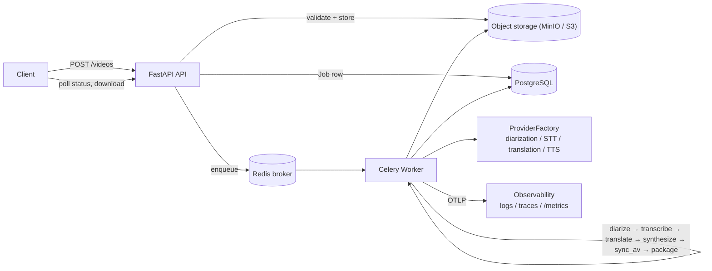
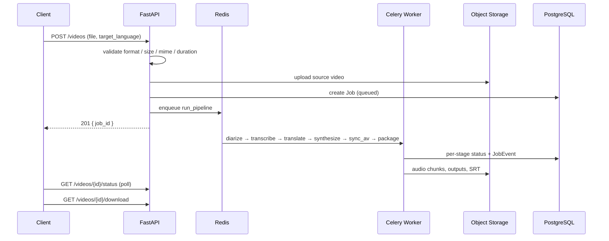

# Architecture Document — AI Video Dubbing Platform

## 1. High-Level Architecture

┌──────────┐ ┌─────────────┐ ┌───────────────┐
│ Client │────▶│ FastAPI │────▶│ PostgreSQL │
│ (curl/ │ │ (api/) │ │ (jobs, specs, │
│ Postman)│◀────│ │◀────│ transcripts) │
└──────────┘ └──────┬──────┘ └───────────────┘
│
│ enqueue job
▼
┌─────────────┐
│ Redis │◀─── broker + result backend
│ (Celery MQ) │
└──────┬──────┘
│
▼
┌─────────────┐ ┌───────────────┐
│ Celery │────▶│ MinIO / S3 │
│ Worker │◀────│ (video, audio, │
│ (workers/) │ │ outputs) │
└──────┬──────┘ └───────────────┘
│
▼
┌─────────────────────┐
│ Provider Factory │
│ (providers/) │
│ ┌─────┬─────┬─────┐│
│ │diar.│ STT │trans││
│ ├─────┼─────┼─────┤│
│ │ TTS │ │ ││
│ └─────┴─────┴─────┘│
└─────────────────────┘

The API and worker are separate processes (separate containers) sharing the
same codebase, DB, and object storage — this is what makes the worker tier
horizontally scalable independent of the API tier.

## 2. Component Interactions

1. Client uploads video → `POST /videos` → API validates (format/size/mime-sniff) → uploads to storage → creates `Job` row (status=`queued`) → enqueues `run_pipeline` task → returns `job_id` immediately (non-blocking).
2. Celery worker picks up the job, runs a **task chain**: `diarize → transcribe → translate → synthesize → sync_av → package_output`. Each stage is its own retryable Celery task, writes its own status + `JobEvent` row on entry, and persists its output to Postgres/storage before the next stage starts.
3. Client polls `GET /videos/{id}/status` (or a future SSE/WebSocket endpoint fed by Redis pub/sub) to track progress.
4. On completion, `GET /videos/{id}/download` and `/subtitles` return pre-signed/local URLs to the final artifacts.

## 3. Processing Pipeline

| Stage | Input | Output | Provider(s) |
|---|---|---|---|
| Diarization | source video | speaker-labeled time segments | pyannote.audio (local) |
| Transcription | source audio | timestamped transcript, speaker-attributed | faster-whisper (local) |
| Translation | transcript | translated transcript, same segment structure | Gemini (API) |
| Synthesis | translated transcript | per-segment TTS audio chunks | edge-tts (free, local call) |
| AV Sync | audio chunks + original video | composite audio track muxed onto original video | ffmpeg |
| Packaging | transcript + video | SRT file, dubbed video, transcript text, all uploaded to storage | — |

Every stage above the ffmpeg layer sits behind a provider **abstract base
class** (`providers/*/base.py`) and is resolved at runtime by
`ProviderFactory` based on config — swapping `faster_whisper` for
`deepgram`, or `gemini` for `openai`/`claude`, is a one-line config change
with zero code touched in the API, worker, or pipeline logic.

## 4. AI Model Selection Strategy

All four provider categories chose **free-tier / local** options for this
submission, prioritizing zero-friction reproducibility for reviewers over
peak quality:

- **Diarization — pyannote.audio**: strong open-source diarization
  accuracy; requires a free HuggingFace token (gated model license, no
  payment). Trade-off: CPU inference is slow on longer clips — GPU
  recommended for production.
- **STT — faster-whisper**: local inference, no API key, no per-request
  cost or rate limit — ideal for repeated test runs during a take-home
  assignment. Trade-off: accuracy slightly below Whisper large models
  depending on chosen model size; `base` used for speed.
- **Translation — Gemini (gemini-2.5-flash)**: free-tier API key, strong
  translation quality, fast. Swappable for OpenAI/Claude/DeepL via the same
  interface — only `TranslationProvider.translate()` needs implementing.
- **TTS — edge-tts**: free, no API key, good voice quality via Microsoft
  Edge's neural voices. Speaker "identity" is approximated by alternating
  between two voices per language per speaker index — **not** true voice
  cloning. Production would swap to ElevenLabs or Coqui with per-speaker
  reference audio for genuine voice preservation.

## 5. Queue Architecture

Celery + Redis (broker + result backend). Chosen over RabbitMQ/Kafka/SQS for
simplicity — Redis is already a dependency for job-status pub/sub, so it
serves double duty without adding another infra component. `task_acks_late`
ensures a task is redelivered if a worker dies mid-processing rather than
being silently lost.

## 6. Scaling Strategy — 5 → 500 → 5,000 videos/day

**5 videos/day (current setup):** single API container, single worker
container (concurrency driven by the `max_concurrent_processing_jobs` setting,
not a hardcoded flag), single Postgres/Redis/MinIO instance. No
changes needed.

**500 videos/day:**
- Scale `worker` horizontally: `docker compose up --scale worker=4` (or
  equivalent in an orchestrator). Workers are stateless — all state lives in
  Postgres/Redis/object storage — so this requires zero application code
  changes.
- Redis queue depth becomes the autoscaling signal: a Kubernetes
  `HorizontalPodAutoscaler` (or equivalent) watching Celery queue length via
  a custom metric can add/remove worker replicas automatically.
- Postgres connection pooling (PgBouncer) becomes worthwhile at this scale.

**5,000 videos/day:**
- Full container orchestration (Kubernetes/ECS/AKS/GKE) with worker pools
  separated **by stage** — diarization/STT are CPU/GPU-heavy and benefit
  from dedicated node pools with GPU scheduling, while translation/TTS are
  I/O-bound (waiting on external APIs) and can run on cheap CPU-only nodes
  with high concurrency.
- Chunked processing for long videos: split a video into segments before
  diarization so no single task holds a worker slot for the video's full
  duration.
- Sharded job distribution by `job_id` hash across multiple Redis/Celery
  queue instances to avoid a single broker becoming a bottleneck.
- Object storage (S3) already scales horizontally with no changes needed;
  Postgres would move to a managed, read-replica-backed instance.
- **Not implemented in this submission** (described only, per assignment
  allowance): Kubernetes manifests, multi-region deployment, the full
  Prometheus/Grafana dashboard stack. The observability contract is
  implemented and operational: structured logs (`structlog`), OpenTelemetry
  tracing, and a Prometheus-format `GET /metrics` scrape endpoint
  (`vdp_jobs_*`, `vdp_uploads_active`, `vdp_queue_depth`, HTTP counters) that
  feeds any Prometheus/Grafana/ELK deployment via config swap — no code
  changes.

## 7. Failure Recovery

- **Provider-level failures** (timeout, rate limit, transient
  unavailability): caught as typed exceptions (`providers/errors.py`),
  retried via Celery's `autoretry_for` with exponential backoff + jitter, up
  to `retry_count` (configurable).
- **Auth failures** (`ProviderAuthError`): intentionally **not** retried —
  fail fast, since retrying a bad API key wastes time and quota.
- **Partial pipeline failure**: each stage commits its output to Postgres
  before the next stage begins, so a failure at stage N doesn't lose
  progress from stages 1..N-1. A `retry` on a failed job re-runs the full
  chain currently (idempotent by design — re-running diarization/STT is
  safe since they're deterministic given the same input), though a future
  optimization could resume from the last successful stage.
- **Corrupted/invalid uploads**: rejected synchronously at upload time via
  extension check, size check, and mime-sniffing (`python-magic`) before a
  job is even created — no wasted pipeline capacity on bad input.
- **Cooperative cancellation**: `POST /{id}/cancel` sets job status to
  `cancelled`; each pipeline stage checks this flag before starting its own
  work and exits early rather than being force-killed mid-task, avoiding
  partial/corrupted outputs.

## 8. Observability

| Pillar | Implementation |
|---|---|
| Structured logging | `structlog` everywhere (`api/main.py`, `workers/tasks.py`); key-value events (`request_start/end`, `stale_job_recovered`, `pipeline_failed`). Pluggable output → stdout (dev) or JSON/ELK collector |
| Error tracking | All failures logged with structured context (`job_id`, `stage`, `error`); unhandled exceptions funneled through a single handler in `api/main.py`. Swap in Sentry by attaching to that handler |
| Request tracing | OpenTelemetry init (`core/telemetry.py`) + FastAPI instrumentor; traces export to any OTLP collector (`OTEL_*` settings). The compose stack bundles a `jaeger` all-in-one and the API exports to it by service name (`http://jaeger:4317`); point `OTEL_EXPORTER_ENDPOINT` elsewhere to swap collectors, or set `OTEL_ENABLED=false` to opt out |
| Metrics | Prometheus-format `GET /metrics` (self-contained, no deps): job counters (created/completed/failed), gauges (`uploads_active`, `processing_active`, `queue_depth`), labeled HTTP counters (method × route-template × status), 429-rejection counters by reason. `queue_depth` degrades to `-1` if the DB is unreachable so scrapes survive outages. Point Prometheus at `/metrics` and dashboards at that |

## 9. Deployment Strategy

Docker Compose for this submission: `api` (uvicorn), `worker` (Celery),
`beat` (scheduled stale-job recovery), a one-shot `migrate` service (Alembic),
and infrastructure containers `redis`, `postgres`, `minio`, plus a `jaeger`
all-in-one trace backend (OTLP gRPC `:4317`, UI `:16686`) that the API exports
to via the compose service name — each with healthchecks and explicit startup
ordering (`depends_on: condition`). A single
`Dockerfile` (python-slim + ffmpeg + libmagic, CPU-only torch) builds all
app services; worker capacity is tuned by config, not flags. Production
deployment would move to:
- Container images pushed to a registry, deployed via Kubernetes/ECS
- Managed Postgres (RDS/Cloud SQL) and managed Redis (ElastiCache) instead
  of self-hosted containers
- S3 (real, not MinIO) for object storage
- Secrets (API keys, DB credentials) injected via a secrets manager
  (AWS Secrets Manager / Azure Key Vault) rather than `.env` files — the
  config system already supports this transparently since env vars are the
  highest-precedence config source.

## 10. Security

| Measure | Implementation |
|---|---|
| Input validation | `target_language` validated as an ISO 639-1/2 code (± region subtag, e.g. `zh-CN`) before any work happens (`api/validation.py`); Pydantic response models keep response shapes tight |
| File validation | Upload rejected synchronously if (a) extension not in `allowed_video_formats` (400), (b) size exceeds `max_upload_size_mb` (413), (c) libmagic mime-sniff doesn't match a video (400), (d) ffprobe can't read it — corrupt input (400), (e) duration exceeds `max_video_duration_seconds` (422). No job is created for bad input |
| Malicious uploads | Defense in depth: format allowlist + content sniffing + size/duration caps + bounded upload concurrency and queue capacity (429 when saturated) — untrusted content is never executed |
| Rate limiting | slowapi per-IP limits applied to **every** route (`api/rate_limit.py`), threshold live-configurable via `rate_limit_per_minute`; breach → 429 with `Retry-After` via a custom handler |
| Authentication (optional) | `X-API-Key` enforced on all `/videos` routes (`api/auth.py`), enabled by config `api_key_auth_enabled`. Fails closed: auth on with no key configured → 500, never silently open |
| Secure API design | Opaque UUID job IDs (no enumeration), 404/409 semantics don't leak job existence, business routes authed while `/health` + `/metrics` are ops-scoped, delivery via pre-signed URLs, secrets only through env/secrets-manager config channels |

## 11. Storage Design

Storage is behind the `StorageBackend` interface (`storage/base.py`):
`upload` / `download` / `get_url` / `delete` / `exists`. The active backend is
a pure config swap (`storage_backend` setting through any of the config
channels) — application code never touches a concrete implementation.

| Backend | Setting value | Notes |
|---|---|---|
| Local filesystem | `local` | Dev default; `storage_local_path` |
| AWS S3 / MinIO | `s3` | Any S3-compatible endpoint via `s3_endpoint_url` (MinIO = same binary protocol); `get_url` returns pre-signed URLs |
| Azure Blob, GCS | — | Drop-in additions implementing the same 5-method ABC; no app changes |

Object layout (all keys scoped by `job_id`; backend configurable):

| Category | Key | Notes |
|---|---|---|
| Uploaded video | `uploads/{job_id}/source.{ext}` | Kept for re-runs / cancellation-safe re-processing |
| Synthesized audio chunks | `synthesized/{uuid}.wav\|.mp3` | One per translated segment (speaker-tagged via DB) |
| Final video | `outputs/{job_id}/dubbed.mp4` | Long-lived artifact |
| Subtitles | `outputs/{job_id}/subtitles.srt` | Long-lived artifact |
| Transcript text | `outputs/{job_id}/transcript.txt` | Long-lived artifact |
| Intermediate scratch (extracted audio, composite track) | local `work_dir` per worker | Ephemeral, never uploaded; keeps workers stateless and disk bounded |

Lifecycle: intermediates are deleted or garbage-collected after the job
completes; `synthesized/` chunks can be pruned once the final video is built;
`uploads/` + `outputs/` are retained for re-runs and delivery.

## 12. Database Design

Postgres (async SQLAlchemy 2.0; `sqlite+aiosqlite` in tests/dev), schema
managed by Alembic. Relational because jobs need transactional state
transitions, relational integrity, and an audit trail — there's no
document-style data that would justify a NoSQL store.

| Table | Purpose |
|---|---|
| `jobs` | Status + metadata: source/output keys, target language, provider selection, error message, timestamps |
| `speakers` | Per-job speaker identity (id, name, reference audio key) for voice-cloning continuity |
| `transcript_records` | One row per segment: speaker_id, start/end ms, source + translated text, synthesized audio key, voice_id |
| `job_events` | Stage progression log (queued → diarizing → … → completed/failed) |
| `audit_logs` | User actions (upload, cancel, download) with JSON detail |

Job status lifecycle: `queued` → in-flight stage names (`diarizing`,
`transcribing`, …) → `completed` / `failed` / `cancelled`. Every stage commits
its output to Postgres *before* the next stage starts, so state survives a
worker crash and `recover_stale_jobs` can fail only genuinely-dead jobs.

## 13. Automated Testing

`pytest` + `pytest-asyncio` (85 tests). Integration tests run against an
in-memory SQLite DB with Celery dispatch stubbed; the full eager pipeline
runs end-to-end in `test_pipeline.py`. Live e2e (real Postgres/Redis) is
scripted separately.

| Area | File(s) |
|---|---|
| API, auth, operational limits, security | `test_api_integration.py`, `test_auth.py`, `test_limits.py`, `test_security.py` |
| Pipeline, recovery, retries | `test_pipeline.py`, `test_tasks.py` |
| Providers (unit + wire-mock HTTP + factory switching) | `test_providers.py`, `test_providers_http.py`, `test_provider_factory.py` |
| Storage backends | `test_storage.py` |
| Config precedence (env/file/secrets/cloud) | `test_config.py` |
| AV sync + SRT utilities | `test_av_sync.py`, `test_tasks.py` |
| Telemetry + metrics | `test_telemetry.py`, `test_metrics.py` |

Run with `.venv\Scripts\python.exe -m pytest -q`.

## 14. Design Trade-offs

| Decision | Trade-off accepted |
|---|---|
| Free-tier/local providers over paid APIs | Slightly lower ceiling on quality (esp. voice cloning) in exchange for zero-cost reproducibility |
| Best-effort AV sync (chunk placement, no time-stretching) | Simpler ffmpeg pipeline; occasional slight audio drift on segments where TTS output length differs from original speech duration |
| Full pipeline re-run on retry (not resume-from-stage) | Simpler retry semantics; acceptable since all stages are idempotent, at the cost of re-doing completed work |
| Synchronous full-file read on upload (not streaming) | Simpler validation code; would need to move to streaming + incremental size checks for very large files at higher scale |
| SQLite for integration tests, Postgres for real deployment | Fast, dependency-free test runs; accepts a small risk of SQLite/Postgres behavioral differences not being caught by tests |
| Self-contained `/metrics` (no `prometheus_client`/OTel metric SDK) | Zero extra dependencies and scrape survives DB outages; trades off Prometheus histograms/exemplars — swap in `prometheus_client` later without changing the endpoint contract |
